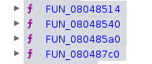

# CyberTools

Voici une liste d'outils et de ressources pour la cybersécurité.

## Table of Contents


# Steganography

- [AperiSolve](https://www.aperisolve.com/)
    Regroupement d'outils de stéganographie en ligne 


# Reverse Engineering

## Gihdra 

### Présentation


A. Vue désassembleur
B. Vue de décompilateur
C. Liste des symboles
D. Catalogue de types
E. Sections du binaire

### Méthodologie

- Regarder les strings
- Regarder les fonctions
- Regarder le main

_**Si le programme est obfusqué**_

Si les fonctions sont nommées de manière aléatoire:


- Regarder les appels de fonctions 
- Regarder les inputs utilisateur

But final: retrouver le main

## Analyse dynamique

### Ltrace

commande en linux permettant d'afficher les appels aux fonctions de bibliothèques partagées d'un programme.

```bash
ltrace ./nom_du_programme
```